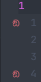

# sus.nvim

## About

`sus.nvim` is a simple plugin that shows a sus icon in your signcolumn. When it finds the word 'sus' written in that line.

## Screenshot


## Installation

### [rocks.nvim](https://github.com/nvim-neorocks/rocks.nvim)
`:Rocks install sus.nvim`

### [Lazy.nvim](https://github.com/folke/lazy.nvim)

```lua
{
    'TarunDaCoder/sus.nvim',
    opts = {}
}

```

### [packer.nvim](https://github.com/wbthomason/packer.nvim)

```lua
-- Add this to your init.lua
use {
    'TarunDaCoder/sus.nvim',
    config = function()
        require('sus').setup()
    end
}
```

### [vim-plug](https://github.com/junegunn/vim-plug)

```vim
" Add this to your init.vim
Plug 'TarunDaCoder/sus.nvim'

lua require('sus').setup()
```

## Config options

> NOTE: The sus icon and text are the default settings, change it if u want to

### You can change the icon to whatever icon you like by changing the `sus_icon` variable

```lua
vim.g.sus_icon = "🦆" -- For all you duck lovers out there
```

#### You can change the text to whatever text you like by changing the `sus_text` variable

```lua
vim.g.sus_text = "duck"
```

## Credits

- code from [@tamton-aquib](https://github.com/tamton-aquib)
